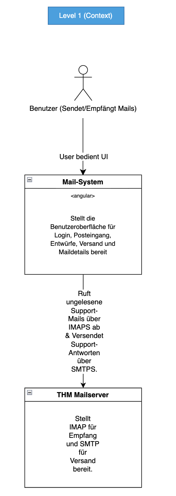
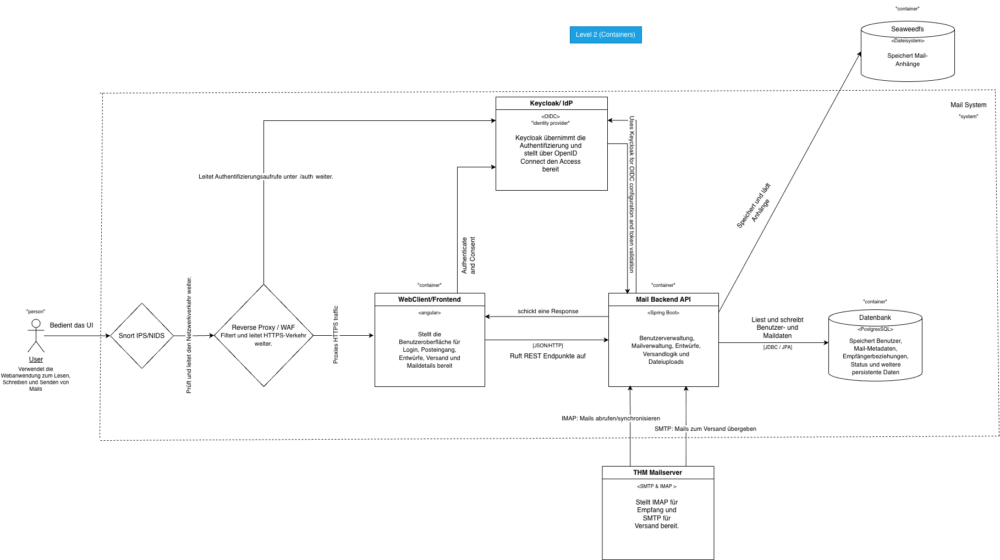
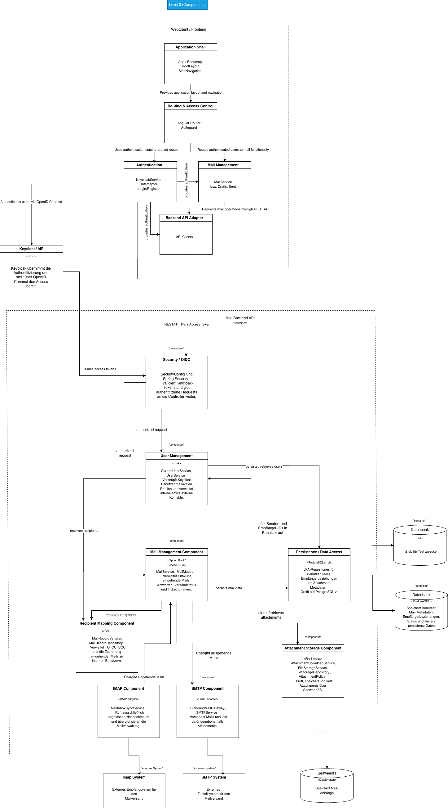

= THM Mail Support Application
:toc:
:toclevels: 3

== Overview

The THM Mail Support Application provides a shared mailbox workflow for an internal support team. Authenticated users can read incoming support requests, create and send replies, manage drafts and attachments, and track related conversations through ticket numbers.

PostgreSQL stores users, mails, recipients and attachment metadata. SeaweedFS stores attachment content through its S3-compatible API. Keycloak provides authentication and authorization. SMTP and IMAP connect the application to a configurable support mailbox.

== Features

* Keycloak login using OpenID Connect Authorization Code Flow with PKCE
* shared access to externally received support mails
* draft, sent, failed and incoming mail views
* support replies addressed to the original external sender
* random ticket numbers in the format `TICKET-XXXXXXXX`
* reuse of existing ticket numbers in subsequent replies
* SMTP delivery through a configurable shared sender address
* incremental IMAP synchronization of unread messages
* attachment storage in an S3-compatible SeaweedFS service
* authenticated attachment downloads and safe inline image previews
* generated OpenAPI 3.1 specification and Swagger UI
* TLS termination and request filtering through ModSecurity with OWASP CRS
* network separation and container hardening
* Snort inline network inspection
* reproducible Gradle build and Docker Compose startup
* static code analysis for the client and server

== Technology stack

* Angular 21.2.21, TypeScript 5.9.3, PrimeNG 21.1.9 and Tailwind CSS 4.3.3
* Kotlin 2.4.10, Spring Boot 4.0.7, Spring Security and Spring Data JPA on Java 25
* Gradle 9.4.0 with downloaded Node.js 24.19.0 and npm 11.19.0 toolchains
* Keycloak 26.6.3 and OpenID Connect
* PostgreSQL 17
* SeaweedFS 4.06 with its S3-compatible API
* Caddy 2.10.2
* ModSecurity with OWASP Core Rule Set 4.25.1
* Snort 3 and Docker Compose
* Detekt 2.0.0-alpha.6 and Angular ESLint 21.4.0
* H2 2.4.240 and Vitest 4.1.11 for automated tests

== Architecture

=== Public request path

[source,text]
----
Browser
  -> localhost:80/443
  -> ips (Snort 3, inline NFQUEUE)
  -> proxy (ModSecurity, OWASP CRS, TLS termination)
     -> frontend:8080
     -> backend:8080
     -> keycloak:8080
----

Only the `ips` service publishes host ports. Port 80 is inspected by Snort and forwarded to the proxy, which redirects the request to HTTPS. Port 443 follows the same inspection path and reaches proxy port 8443. The proxy routes authentication requests to Keycloak, application and documentation requests to the backend, and all remaining requests to the frontend.

TLS terminates at the proxy. Communication between containers remains on isolated Docker networks and uses the corresponding internal service endpoints.

=== Runtime services

[cols="2,5",options="header"]
|===
|Service |Responsibility

|`ips`
|Snort inline inspection and publication of host ports 80 and 443

|`proxy`
|ModSecurity, OWASP CRS, HTTP-to-HTTPS redirect, TLS termination and reverse proxy

|`frontend`
|Caddy process serving the Angular production files

|`backend`
|REST API, business logic, SMTP/IMAP communication and attachment access

|`keycloak`
|OIDC realm, login and access-token issuance

|`database`
|PostgreSQL persistence

|`seaweedfs`
|S3-compatible attachment storage
|===

=== Network separation

[cols="2,3,5",options="header"]
|===
|Network |Members |Purpose

|`ingress`
|`ips`, `proxy`
|Public ingress path

|`web`
|`proxy`, `frontend`
|Static frontend delivery

|`application`
|`proxy`, `backend`, `keycloak`
|API and identity routing

|`database`
|`backend`, `database`
|PostgreSQL access

|`storage`
|`backend`, `seaweedfs`
|S3-compatible attachment access
|===

The backend is the only service connected to both persistence networks. PostgreSQL and SeaweedFS have no network connection to the public ingress service.

== Authentication and authorization

Keycloak is the system's identity provider. Docker Compose imports the `mail-system` realm, the public `mail-system-frontend` client and five development users from `keycloak/mail-system-realm.json`.

The Angular client uses the official Keycloak JavaScript adapter with Authorization Code Flow and PKCE `S256`. Tokens remain in the adapter's in-memory state and are refreshed before protected API calls. The Spring Boot backend is a stateless OAuth2 resource server and validates token signatures, expiration and issuer information using the configured realm and JWK set.

Local business profiles contain no password and are linked to Keycloak through the stable OIDC `sub` claim. The application has no separate local login, self-registration or application-issued JWT.

Keycloak runs with `start-dev` on its private application network. Its public issuer, redirect and logout URLs use the HTTPS proxy endpoint.

=== Development users

All imported users use the password `demo-password`.

[cols="2,3",options="header"]
|===
|Name |Login
|Ameline Allanson |`aallanson@example.com`
|Sanson Vardey |`svardey1@example.com`
|Jami Poe |`jpoe@example.uk`
|Trent Ianno |`tianno3@example.com`
|Alikee Raisbeck |`araisbeck4@example.com`
|===

== Support-mail workflow

=== Incoming mails

The IMAP synchronizer opens the configured mailbox folder with write access and searches only for messages without the `SEEN` flag. It imports the sender, subject, text content and attachments and makes the resulting support mail available to all internal users.

An IMAP message is marked as `SEEN` only after its mail data and attachments have been stored successfully. A failed import remains unread and is retried during a later synchronization. The external `Message-ID` provides an additional deduplication guard; a message whose ID already exists can be marked as seen without importing a duplicate.

Polling remains disabled when the required IMAP host or credentials are empty.

=== Replies and ticket numbers

The reply action creates a draft linked to the selected incoming mail and addresses it to the original external sender. The authenticated user remains the internal author.

The first reply assigns a random ticket number in the format `TICKET-XXXXXXXX` when the incoming subject does not already contain one. The visible reply subject uses the format `[TICKET-XXXXXXXX] Re: <subject>`. Further replies reuse the existing ticket number.

SMTP uses `MAIL_FROM_ADDRESS` as the visible sender and the configured `SPRING_MAIL_USERNAME` and `SPRING_MAIL_PASSWORD` for authentication. No separate `Reply-To` header is set, so external replies return to the same shared sender address.

The mail status changes to `SENT` only after successful delivery. A delivery failure persists the status `ERROR` and is returned by the API as a gateway error. SMTP delivery remains disabled when no host is configured.

== Attachments

HTTP uploads and IMAP imports use the same attachment policy. The default limits are 5 MiB per file and 10 MiB for the complete request. File names and media types are normalized before content is written under a generated SeaweedFS object key. Internal object keys are not exposed through REST responses.

New S3 objects are removed when the corresponding database transaction rolls back. When attachments or mails are replaced or deleted, obsolete objects are removed after the database commit.

Attachment access is authorized through the associated mail. Downloads use `Content-Disposition: attachment` and `X-Content-Type-Options: nosniff`. JPEG, PNG, GIF and WebP may additionally be requested through the authenticated inline-preview endpoint. HTML, SVG and unknown formats are always served as downloads with `application/octet-stream`.

Existing draft attachments are retained by identifier when a draft is edited and therefore do not have to be downloaded and uploaded again.

== REST API and OpenAPI

The backend generates an OpenAPI 3.1 description from its code and annotations during startup. The specification contains authentication information, operation identifiers, tags, summaries, descriptions, success and error responses, required properties and the common `AppError` response body.

The documentation endpoints are public:

* Swagger UI: https://localhost/swagger-ui/index.html
* OpenAPI JSON: https://localhost/v3/api-docs
* OpenAPI YAML: https://localhost/v3/api-docs.yaml

Application endpoints below `/api/**` require a valid Keycloak access token.

== Security

=== TLS and WAF

The proxy uses the self-signed certificate and private key from `proxy/cert/`. The certificate covers the local endpoints and must be accepted by the browser before the application can be opened through https://localhost.

OWASP CRS runs in blocking mode with blocking paranoia level 2 and detection paranoia level 3. Audit output contains transaction metadata and rule messages, but omits complete request and response headers and bodies so that bearer tokens, Keycloak cookies and mail content are not recorded.

The WAF remains enabled for every routed application endpoint. Its local `/healthz` endpoint contains no application functionality and is excluded from WAF processing.

The following target-specific exclusions prevent verified framework payloads from producing false positives:

* CRS rule 934190 ignores only Keycloak's validated `redirect_uri` and `post_logout_redirect_uri` parameters below `/auth/`.
* CRS rules 942420 and 942440 ignore only Keycloak's integrity-protected `KC_RESTART` cookie below `/auth/`.
* CRS rule 942520 ignores only Keycloak's integrity-protected `KC_AUTH_SESSION_HASH` cookie below `/auth/`.
* For `/api/mails`, rule 920272 ignores binary multipart request-body bytes and rules 942200, 942340, 942370, 942430, 942431 and 942460 ignore only the JSON multipart field `ARGS:data`.

All URI, header, filename and remaining parameter checks stay active. The backend additionally applies typed JSON deserialization, Bean Validation, recipient validation, parameterized persistence, attachment-size limits and file metadata normalization.

The proxy uses a bounded `/tmp` filesystem as `MODSEC_UPLOAD_DIR` for multipart processing.

=== Container hardening

[cols="2,5,5",options="header"]
|===
|Service |Hardening |Required writable resources and privileges

|`frontend`
|UID/GID 1000, read-only root filesystem, all capabilities dropped, `no-new-privileges`, bounded `/tmp`, `/config` and `/data` filesystems
|Caddy's low-port file capability is removed and the service listens internally on port 8080

|`backend`
|Read-only root filesystem, all capabilities dropped, `no-new-privileges`, bounded `/tmp` filesystem
|None

|`seaweedfs`
|UID/GID 1000, read-only root filesystem, all capabilities dropped, `no-new-privileges`, bounded `/tmp` filesystem
|Writable `/data` volume for attachment content

|`database`
|Read-only root filesystem, all capabilities dropped by default, `no-new-privileges`, bounded runtime filesystems
|Writable data volume and `CHOWN`, `DAC_OVERRIDE`, `FOWNER`, `SETGID`, `SETUID` for the PostgreSQL entrypoint and process

|`keycloak`
|All capabilities dropped, `no-new-privileges`, bounded `/tmp` filesystem
|Writable root filesystem because `start-dev` writes below `/opt/keycloak/lib`

|`proxy`
|All capabilities dropped, `no-new-privileges`, bounded `/tmp` filesystem, image user 101
|Writable root filesystem because the image generates Nginx and CRS configuration during startup

|`ips`
|All capabilities dropped by default, `no-new-privileges`, bounded `/tmp` filesystem
|Root user, `DAC_OVERRIDE`, `NET_ADMIN`, `NET_RAW`, `SETGID`, `SETUID`, IP forwarding and writable generated Snort configuration for iptables and NFQUEUE
|===

No container runs in privileged mode, and no service mounts the Docker socket.

=== Network inspection

The `ips` image loads Snort 3 and its community rules and processes both public ports through NFQUEUE in inline mode. HTTP and HTTPS packets therefore pass through Snort before reaching the WAF. ModSecurity performs application-aware filtering after TLS termination.

== Configuration

All supported environment variables and their local defaults are defined in `.env.example`. Copy the file to `.env` when values need to be changed:

[source,powershell]
----
Copy-Item .env.example .env
----

On Linux or macOS:

[source,bash]
----
cp .env.example .env
----

The `.env` file is ignored by Git. Real credentials must not be committed.

[cols="3,6",options="header"]
|===
|Variable group |Purpose

|`DB_*`
|PostgreSQL database, user, password and schema behavior

|`KEYCLOAK_*`, `OIDC_*`
|Keycloak administrator, public URL, issuer, JWK set and discovery URL

|`APP_CORS_ALLOWED_ORIGINS`
|Allowed browser origins

|`STORAGE_S3_*`
|SeaweedFS endpoint, bucket, region and credentials

|`ATTACHMENT_MAX_FILE_SIZE`, `ATTACHMENT_MAX_REQUEST_SIZE`
|Shared attachment limits for HTTP and IMAP

|`SPRING_MAIL_*`, `MAIL_FROM_ADDRESS`
|SMTP connection, authentication and visible sender address

|`MAIL_IMAP_*`
|IMAP connection, folder and polling interval
|===

The application starts with local defaults when no `.env` file exists. Actual SMTP and IMAP communication requires valid mailbox credentials.

== Build and run

=== Prerequisites

* Docker with Docker Compose
* JDK 25 available to Gradle

The Gradle wrapper is included in the repository. Gradle, Node.js, npm, PostgreSQL and Keycloak do not have to be installed globally for the standard build and Compose workflow.

=== Complete Compose stack

On Windows:

[source,powershell]
----
.\gradlew.bat composeUp
----

On Linux or macOS:

[source,bash]
----
./gradlew composeUp
----

This command performs the following operations:

. installs the locked frontend dependencies with `npm ci`;
. runs Detekt and ESLint;
. executes the backend and frontend tests;
. creates the Angular production output;
. builds the backend, frontend and Snort images;
. starts all Compose services and waits for their health checks.

The application is available at https://localhost. Requests to http://localhost are redirected to HTTPS.

Stop the services without deleting their persistent volumes:

[source,powershell]
----
.\gradlew.bat composeDown
----

=== Development and distribution builds

Run both linters, both test suites and the frontend production build without starting containers:

[source,powershell]
----
.\gradlew.bat check
----

Run only the linters:

[source,powershell]
----
.\gradlew.bat lint
----

Create the backend and frontend distribution under `build/install`:

[source,powershell]
----
.\gradlew.bat clean check installDist
----

For Angular live development, start the Compose services and run the frontend development server with Node.js 24 and npm 11 available on the local `PATH`:

[source,bash]
----
cd frontend
npm ci
npm start
----

The Angular development proxy forwards `/api`, `/auth`, `/v3/api-docs` and `/swagger-ui` to https://localhost. The development UI is available at http://localhost:4200.

== Repository structure

....
backend/                 Spring Boot source, tests and quality configuration
frontend/                Angular source, tests and Docker build
gradle/                  Gradle wrapper files
ips/                     Snort image and NFQUEUE configuration
keycloak/                Realm, OIDC client and development users
proxy/                   WAF routes and local TLS certificate
docker-compose.yml       Complete local stack
.env.example             Environment-variable reference
README.adoc              System documentation
team.txt                 Team members and matriculation numbers
....

== Architecture diagram
C4 Level 1 (Context), Level 2 (Container) and Level 3 (Components) diagrams

